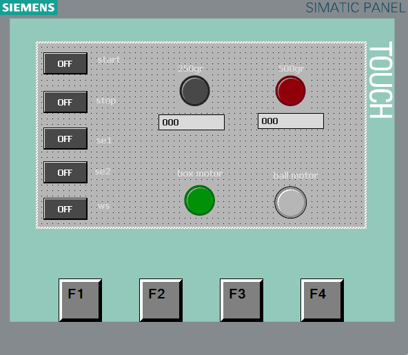

# Lab7 Dual Motor Simulation

## Overview
This project simulates a coordinated production system using two motors — **Box Motor** and **Ball Motor** — operating under a counter-based control strategy.  
The system is designed and tested in Siemens TIA Portal using Ladder Logic, with an HMI panel for process monitoring and visualization.

## System Description
- The system begins when the **Start** button is pressed.  
- Both motors are controlled in sequence to simulate different stages of a production process.  
- A **CTU counter** keeps track of the production cycles.  
- When the counter reaches a predefined number (e.g., 10 cycles), the system halts automatically.  
- **Conditional JMP instructions** are used to handle logic branching (e.g., switching between Box Motor and Ball Motor states).  
- **HMI interface** displays live motor statuses, cycle counts, and allows operator control for start/stop functions.

## Technical Components
- **PLC:** Siemens S7-1200  
- **Programming Environment:** TIA Portal  
- **Programming Language:** Ladder Diagram (LD)  
- **HMI:** Siemens SIMATIC Panel  
- **Inputs:** Start, Stop, Reset  
- **Outputs:** Box Motor, Ball Motor, Counter Display, Indicator LEDs

## Key Learning Outcomes
- Development of **multi-motor control systems**  
- Application of **conditional branching (JMP)** and **counter logic**  
- Real-time process visualization with **HMI integration**  
- Simulation of sequential manufacturing operations

### HMI Interface
