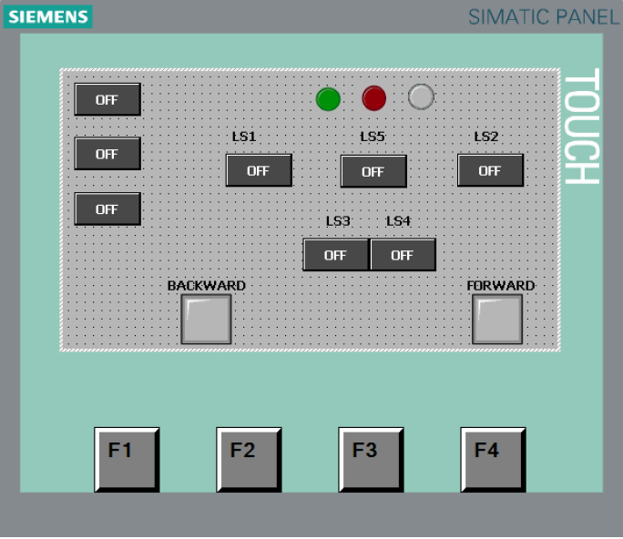

# Photo Sensor Conveyor

## 🧩 Overview
This project demonstrates an automated conveyor system controlled by photo sensors and limit switches. 
The system uses a Siemens S7-1200 PLC programmed with Ladder Logic in TIA Portal, and includes an HMI interface for user interaction.

## ⚙️ System Description
- The conveyor starts when the **Start** button is pressed.
- A **photo sensor** detects the presence of an object on the belt.
- When an object is detected:
  - The **forward motor** activates to move the object.
  - Corresponding **LED indicators** (green/yellow/red) display system status.
  - A **buzzer** sounds if a fault condition is detected.
- **Limit switches (LS1–LS5)** are used to determine the position of the object on the conveyor and to trigger forward/reverse motion.

## 💻 Technical Components
- **PLC:** Siemens S7-1200  
- **Programming Environment:** TIA Portal  
- **Programming Language:** Ladder Diagram (LD)  
- **HMI:** Siemens SIMATIC Panel  
- **Inputs:** Start, Stop, Photo Sensor, Limit Switches  
- **Outputs:** Motors (Forward/Backward), LEDs, Buzzer

## 🎯 Key Learning Outcomes
- Implementation of **sensor-based control** and **motor direction logic**
- Use of **interlock mechanisms** for motion safety
- Integration of **HMI visualization** for real-time monitoring
- Development of a **fully automated material handling simulation**

### HMI Interfac
